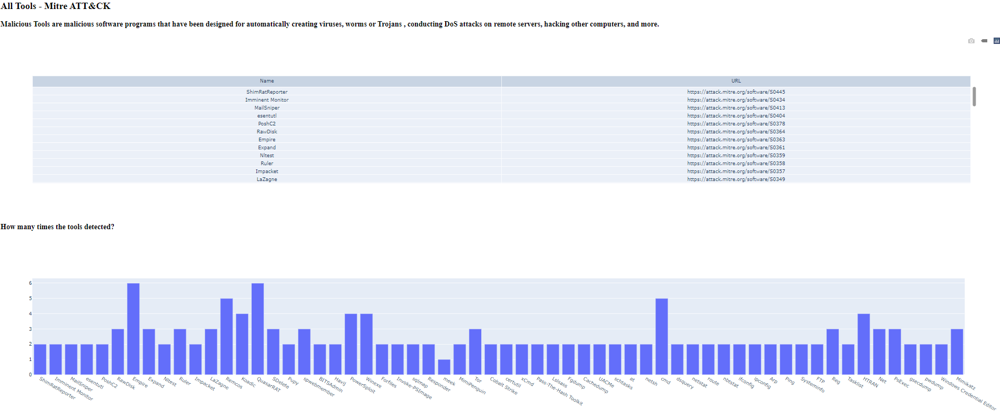
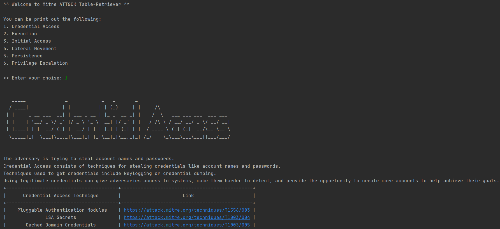
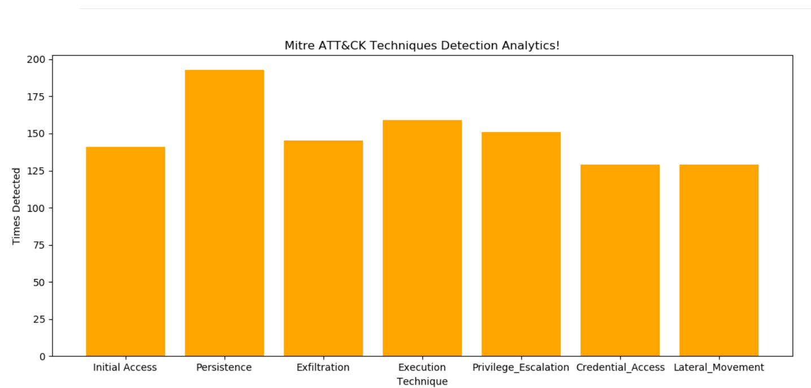
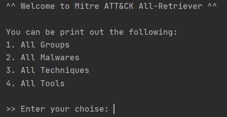
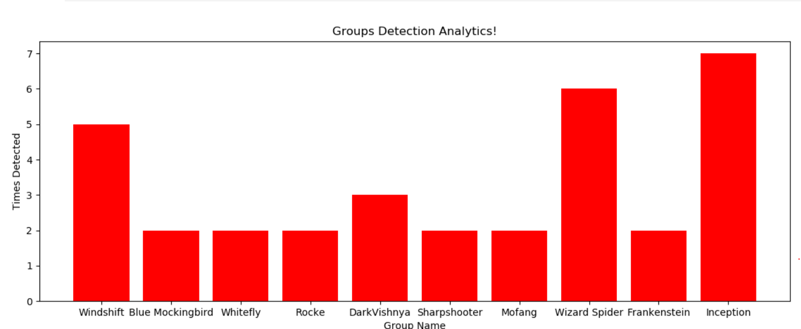
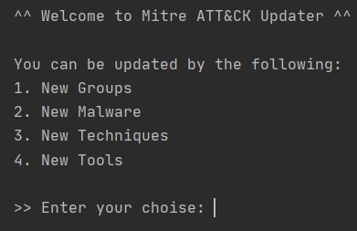

# Bullsec - MITRE™ ATT&CK™ Analytics
## Utilities for Bullsec - MITRE™ ATT&CK™ Analytics

This repository contains the following Groups, Techniques, Malwares and Tools with the help of:

* **dasher:** Dash app that runs on local laptop or workstation and provide ML based Data Analytcs abpust multiple data provided by MITRE™ ATT&CK™.  

* **tabler:** All relevant data about Groups, Techniques, Malwares and Tools via Pretty table.

* **technique_analytics:** Dash app that runs on local laptop or workstation and provide ML based Data Analytcs about all data provided by MITRE™ ATT&CK™.

* **all_things_To_csv:** All relevant data about Groups, Techniques, Malwares and Tools exported as CSV file.

* **times_detected:** How many times MITRE™ ATT&CK™ Groups, Techniques, Malwares and Tools were detected?

* **updater:** Stay updated on the new MITRE™ ATT&CK™ Groups, Techniques, Malwares and Tools.

## Overview
There are many use cases for ATT&CK™ framework, many of which depend on existing tools being ATT&CK™-enabled, to make this process easier, this repository can help in getting up to speed with integrating existing tools with ATT&CK™, convinient presentation of the data etc.

To have a better understanding about the benefits of these tools, following is a list of sample queries used to read ATT&CK™. To run the following queries, you will need a Python IDLE only, there are many free and paid tools available supporting Windows, macOS and Linux.

## Examples
### dasher.py

### tabler.py

### technique_analytics.py

### all_things_To_csv.py

### times_detected.py

### updater.py

